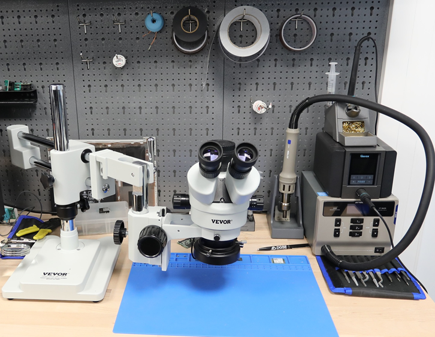
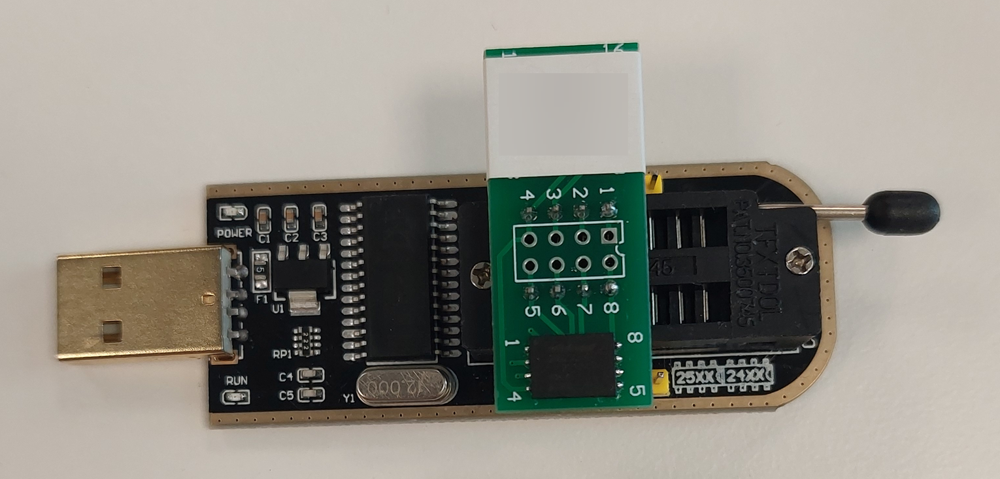

# Introduction and Objectives

## Introduction

The purpose of this testing methodology is to assess the robustness and low-level configuration of a user workstation.  
It applies in a context where the security audit sponsor is not the manufacturer of the workstation, but rather a company that has acquired a fleet of machines from a vendor (HP, Dell, etc.) and wishes to evaluate the risks inherent to their design.

Some proposed remediations may be particularly restrictive (for example, setting an ATA password). However, they serve as a reference point for achieving the highest possible level of security; it is up to the sponsor to determine whether to implement them and to assess the associated risks.

## Audit Phases

The methodology follows the process below:

This process may evolve according to future updates of the methodology.  
**Note:** In the diagram, all red boxes indicate a risk of destruction, data loss, or hardware damage.

The approach includes the following phases:

- **Reconnaissance phase:**
  - Without physical access  
  - With physical access  

- **Firmware-related attacks:**
  - Removal of access passwords  
  - Removal of protections  

- **DMA attacks:**
  - Via PCIe ports  
  - Via Thunderbolt  

- **Signal interception attacks**

- **Cold boot attacks**

Finally, the post-exploitation phase aims to gain control of the operating system.

The objective is to identify, at each stage, vulnerabilities inherent to the workstation’s design and, whenever possible, to propose appropriate remediation measures.

## Tools and Techniques

Each audit phase relies on specific techniques and hardware/software tools. Below is a general overview of the applicable techniques and tools.

---

## Soldering

In many cases, it is necessary to desolder electronic components to carry out certain attacks.  
Additionally, in some situations, it is useful to solder probes onto components in order to intercept signals.

To do so, it is essential to have appropriate tools, such as:

- Temperature-controlled soldering station  
- Temperature-controlled hot air rework station  
- Trinocular microscope equipped with a ring light, used for component inspection and fine soldering  
- Precision tweezers (≈ 100 µm)  
- Precision wires (≈ 10 µm), Kapton tape, aluminum tape, etc.  
- Stencils in various formats for reballing operations if necessary  
- Various types of solder and solder paste adapted to different temperature ranges  

---

## Analysis and Measurement

An environment for electronic signal analysis is also useful. It should include at least the following tools:

- 4-channel oscilloscope, 250 MHz, with appropriate probes  
- Laboratory power supply with controlled voltage and current  
- Various measurement probes (e.g., PCBite)  
- Assorted clamps and accessories for temporary connections and manipulations  

---

## Firmware Modification

### Techniques Used

Firmware modification of the audited workstation’s motherboard is required when a BIOS/UEFI access password is set.  
Indeed, performing certain hardware attacks (such as DMA or cold boot attacks) requires access to BIOS/UEFI settings, particularly to disable protection mechanisms.

Before any modification, auditors systematically perform a full firmware dump to establish a reference baseline, enabling rollback in case of issues.

Since firmware modification is a very low-level operation, it carries a risk of malfunction or even rendering the workstation unusable.

To perform these modifications, auditors may rely on several approaches:

- Reusing third-party firmware found online  
- Using BIOS password removal tools  
- Manually modifying NVRAM variables  
- Injecting malicious code at the firmware level (DXE modules)  

Each of these methods presents a risk of failure or instability and must be implemented carefully in a controlled environment.

### Tools

For firmware modification, auditors use various hardware and software tools suitable for reading, analyzing, and reprogramming non-volatile memory.

#### Hardware Equipment

- **XGecu Pro T56 programmer** (~€400)  
  High-quality professional programmer enabling fast reading and writing of a wide range of memory components (Flash, EEPROM, etc.), including chips up to 48 pins. It offers excellent compatibility and reliability for sensitive firmware operations.

- **CH341A programmer** (~€15)  
  Low-cost and widely used programmer for reprogramming Flash NOR (25QXXX) and EEPROM (24C/24QXXX) chips up to 8 pins. Although more limited and slower than the T56, it is sufficient for most laptop firmware reprogramming tasks.

- **SOIC-8 clip** (~€5)  
  Accessory enabling in-circuit reading and writing of SOIC-8 chips without desoldering, reducing the risk of motherboard damage.

- **TSOP-8 adapter**  
  Used when desoldering is required. This adapter allows easy connection of a TSOP-8 chip to the programmer for reprogramming.

  
XGecu Pro T56 programmer with a SOIC-8 clip for in-circuit memory chip reading or writing.

  
CH341A programmer connected to a QFN8-to-DIP8 adapter, allowing handling of different memory chip formats.

#### Software Tools

- **XGPro** — Official software associated with the XGecu Pro T56 programmer, enabling reading, writing, verification, and identification of memory components.

- **UEFITool** — Open-source tool for analyzing UEFI firmware. It allows exploration of the firmware’s internal structure (volumes, files, DXE/PEI modules), identification of critical components, and preparation of targeted modifications.

- **MEAnalyze** — Tool specialized in analyzing Intel Management Engine (ME) firmware. It provides detailed information on version, configuration status, enabled features, and potential inconsistencies or weaknesses.

- **IDA (Interactive Disassembler)** — Reverse engineering tool used to analyze binary code within firmware, including DXE modules or security-related routines. It enables in-depth understanding of firmware internals and advanced modifications.

---

## Signal Interception

### Techniques Used

The physical TPM interception attack consists of intercepting hardware communications between the TPM (Trusted Platform Module) and the CPU.

When disk encryption is enabled at the operating system level and no PIN code is configured, the decryption key is automatically transmitted by the TPM to the CPU during system boot.  
This key travels in cleartext over the hardware communication bus connecting the TPM to the CPU, typically SPI or I²C.

With physical access to the motherboard, an attacker can place hardware probes on the communication lines of this bus.  
These probes are connected to a logic analyzer, allowing capture and decoding of exchanges in order to identify and recover the decryption key.

Once obtained, the encrypted disk content can be decrypted offline without requiring user authentication or access to the operating system.

### Tools Overview

#### Hardware Equipment

- **PCBite SP10 probes** (~€250)  
  Pogo-style probes allowing temporary and precise contact with test points, traces, or SMD components without soldering. Particularly suitable for intercepting SPI or I²C bus signals near the TPM.

- **DSLogic U3Pro32** (~€400)  
  32-channel logic analyzer capable of up to 1 GHz sampling. Enables reliable capture of high-frequency signals during critical boot phases.

  
U3Pro32 logic analyzer connected to PCBite SP10 probes.

#### Software Tools

- **DSView** — Software associated with DSLogic analyzers, enabling visualization, recording, and analysis of captured signals. Includes protocol decoding modules (e.g., SPI), facilitating interpretation of exchanges between TPM and CPU.

---

## DMA Attack

### Techniques Used

A DMA attack does not strictly exploit a software vulnerability; rather, it leverages a legitimate hardware feature.

DMA (Direct Memory Access) allows a PCIe device to directly interact with RAM without CPU intervention, improving performance for high-bandwidth devices such as GPUs or network controllers.

To mitigate uncontrolled RAM access while maintaining performance, IOMMU (Input-Output Memory Management Unit) was introduced. It virtualizes memory space by assigning dedicated regions to devices, preventing access to critical OS memory.

However, IOMMU protections can sometimes be disabled in BIOS/UEFI settings. Once disabled, PCIe devices regain full RAM access.

The DMA attack involves connecting a malicious PCIe device to the target system and to an attacker-controlled system.  
This device enables direct read/write access to the victim’s RAM.

Due to this unrestricted memory access, the attacker gains privileges equivalent to—or greater than—the operating system, enabling severe system compromise.

### Tools Overview

#### Hardware Equipment

- **PCI Squirrel** (~€250)  
  Malicious PCIe x1 card designed to allow direct RAM access via the PCIe bus when IOMMU / VT-d protections are disabled or misconfigured.

- **PCIe adapters** (various formats, ~€1 to a few euros)  
  Adapters converting different PCIe physical formats to exploit available ports on laptops and workstations (e.g., PCIe x4 → NVMe M-Key, NVMe → PCIe x1, etc.).

  
Example of a PCI Squirrel card with various PCIe adapters.

Additionally, adapters enabling PCIe over Thunderbolt:

- PCIe → ExpressCard  
- ExpressCard → Thunderbolt 2  
- Thunderbolt 2 → Thunderbolt 3  

These chained adapters enable hot-plug DMA attacks via exposed Thunderbolt ports.

#### Software Tools

- **PCILeech** — Open-source tool dedicated to DMA attacks, enabling RAM reading/writing via malicious PCIe devices. Supports memory dumping, code injection, and exploitation of anti-DMA misconfigurations.

---

## Cold Boot Attack

### Techniques Used

The cold boot attack exploits RAM data retention when exposed to low temperatures.

By cooling RAM to approximately –60 °C, data retention time can extend to several minutes instead of a few seconds at room temperature.

This allows physical transfer of RAM modules to another computer booted on a minimal environment, minimizing memory overwrite and enabling full memory dumping.

Primary targets include BitLocker keys, session passwords, and other secrets stored in RAM.

If RAM is soldered to the motherboard, physical transfer is impossible. In this case, certain BIOS/UEFI NVRAM variables must be modified to prevent RAM clearing at reboot while allowing alternative OS boot.

The attacker then boots a minimal system and dumps RAM for offline analysis.

### Tools Overview

#### Hardware Equipment

- **Compressed air can (used upside down)**  
  When inverted, it releases liquid propellant, drastically lowering component temperature (~–60 °C), extending RAM data retention time.

- **Compatible secondary computer**  
  Used when RAM modules can be physically transferred.

- **Firmware reprogramming equipment**  
  Programmers, clips, and adapters used to modify BIOS/UEFI NVRAM variables when RAM is soldered.