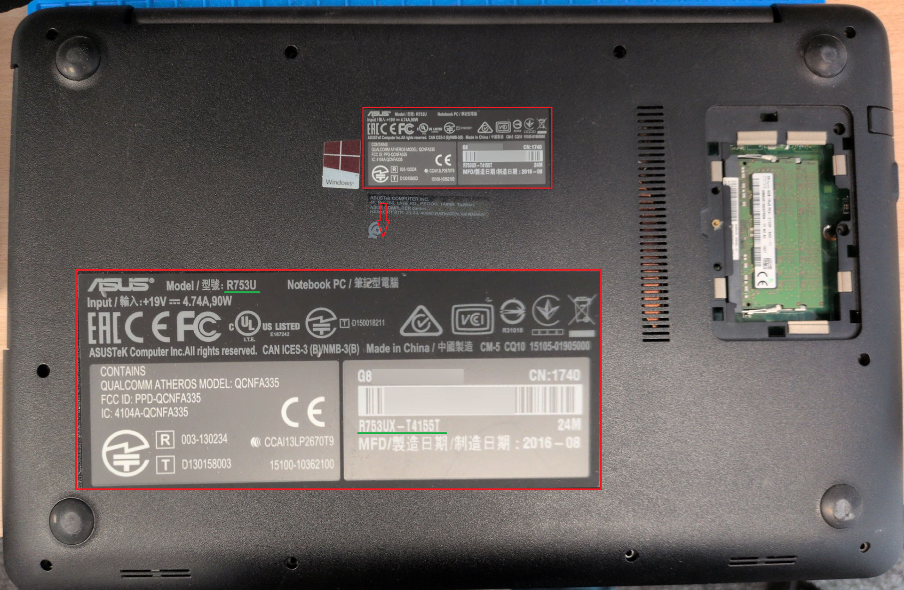
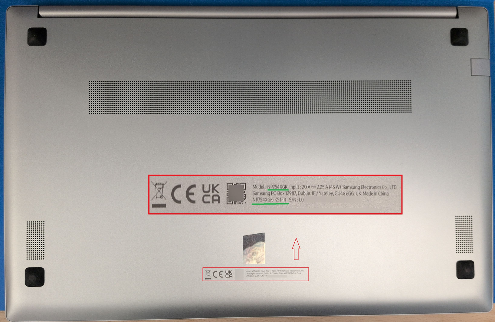

# Identify System Model and Hardware Revision

|ID          |
|------------|
|CHSTG-INFO-01|

## Summary

This control aims to identify the exact system model and hardware revision using only the information physically visible on the device. The purpose of this step is strictly the identification and collection of hardware references that will be used in later analysis phases.

## Test Objectives
- Identify manufacturer and product family from external markings
- Determine the exact system model and variant
- Determine the motherboard reference associated with the device model
- Collect hardware identifiers for future investigation steps

## How to Test
1. Perform an external visual inspection of the device:
   - Manufacturer logo
   - Product series name
   - Model number
   - Service tag / serial number
   - Regulatory labels
   - Asset labels or barcode stickers

2. Record all identifiers exactly as written.

3. Use the collected identifiers in search engines to determine the exact product reference.

4. From the confirmed model name, search the model together with the keyword **motherboard** to identify the motherboard reference associated with the device.

Example:

For each device, perform a search combining the model name with the keyword `Motherboard` to help identify the actual motherboard reference:

- ASUS R753UX
  
  Search: `ASUS R753UX Motherboard`  
Generic motherboard used in several models, also known as **X756UXM**, with part number **DAXK9FMB6C0**.

- HP 430 G6
  
  Search: `HP 430 G6 Motherboard`  
  The result allows you to find the specific motherboard reference (e.g., **DA0X8IMB8E0**).

- Samsung NP754XGK
   
  Search: `Samsung NP754XGK Motherboard`
  You can usually identify the motherboard label (e.g., **TITAN4 NB6099C_PCB_MB_MP1.0**).

This approach allows you to reliably confirm and document both the device model and its corresponding motherboard reference.

5. Document the confirmed model and motherboard reference for later use in subsequent hardware analysis steps.

## Remediation
Not applicable.
