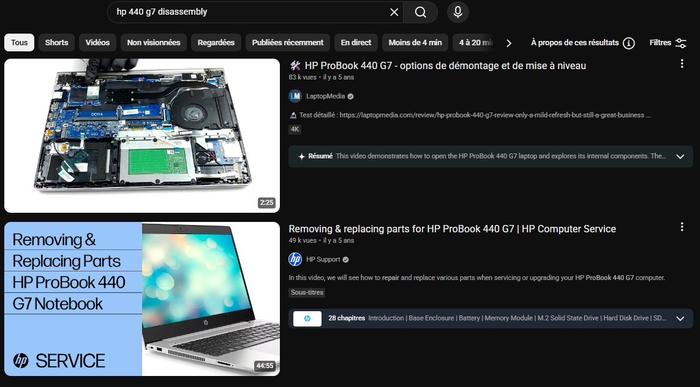

# Collect Disassembly Documentation

|ID          |
|------------|
|CHSTG-INFO-02|

## Summary

This control consists of collecting publicly available documentation describing how the device can be disassembled. The objective is to prepare future hardware analysis steps by understanding the opening procedure without performing any physical action on the device.

## Test Objectives
- Identify official or unofficial disassembly procedures
- Determine opening methods and access points
- Identify required tools
- Anticipate fragile components or risks during disassembly
- Identify potential protection mechanisms (tamper seals, intrusion switches, kill switches, or similar countermeasures)

## How to Test
1. Use the previously identified exact device model.

2. Perform online searches combining the model with keywords such as:
   - disassembly
   - teardown
   - repair
   - service manual

3. Prioritize video platforms and documentation sources.

Example searches:
`hp 440 g7 disassembly`

This may provide explanatory videos, including unofficial repair videos and official manufacturer videos:
- https://www.youtube.com/watch?v=vmipNT6FMMA
- https://www.youtube.com/watch?v=2FG1abY5OYg

4. Review the collected material to identify:
   - Opening sequence
   - Hidden screws or clips
   - Presence of tamper seals or stickers
   - Intrusion detection switches or sensors

5. Collect and archive the relevant resources for later use during hardware analysis.

## Remediation
Not applicable.
