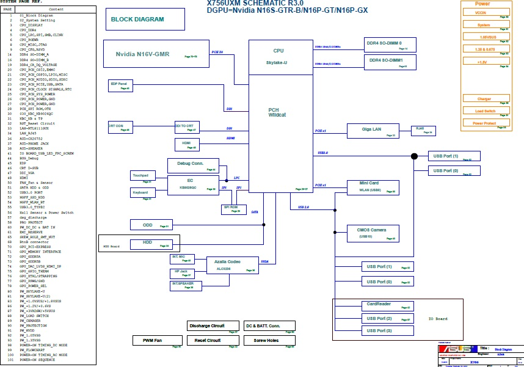
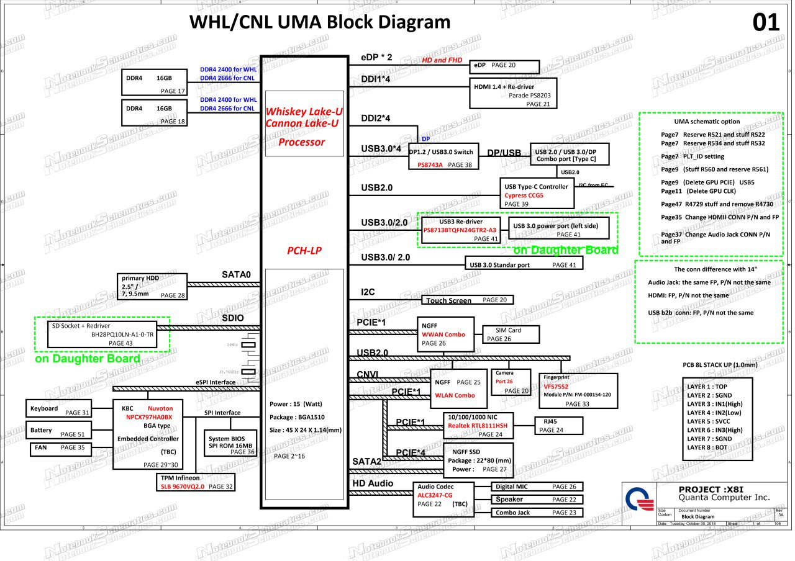

# Collecter la documentation schématique de la carte

|ID          |
|------------|
|CHSTG-INFO-03|

## Résumé

Ce contrôle vise à localiser la documentation schématique de la carte mère en utilisant la référence de carte exacte identifiée précédemment. L'objectif est d'identifier l'existence et la disponibilité des schémas de circuits logiques pour une analyse matérielle ultérieure sans effectuer aucune interaction physique avec l'appareil.

## Objectifs du test
- Identifier la documentation schématique de la carte mère
- Déterminer la disponibilité des schémas de circuits
- Identifier les sources donnant accès aux fichiers schématiques

## Comment tester
1. Utiliser la référence carte mère identifiée lors du test CHSTG-INFO-01.

2. Effectuer des recherches en ligne en combinant la référence de carte avec des mots-clés tels que :
   - schematic (schématique)
   - motherboard schematic
   - board schematic
   - circuit diagram (schéma de circuit)

Exemples de recherche (référence issue du test CHSTG-INFO-01) :

- `DAXK9FMB6C0 schematic`

- `DA0X8IMB8E0 schematic`

- `NB6099C_PCB_MB_MP1.0 schematic`  
  Aucun résultat trouvé (illustrant l’absence de documentation schématique publique pour certains modèles).

3. Examiner les résultats de recherche pour déterminer si la documentation schématique existe.

4. Identifier le type d'accès requis :
   - Fichiers accessibles publiquement
   - Téléchargement payant
   - Plateformes d'accès restreint ou VIP

5. Documenter la disponibilité et les conditions d'accès pour une utilisation ultérieure.

## Remédiation
Non applicable.
