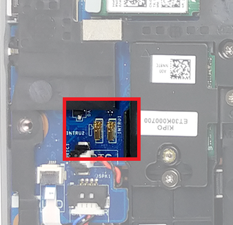
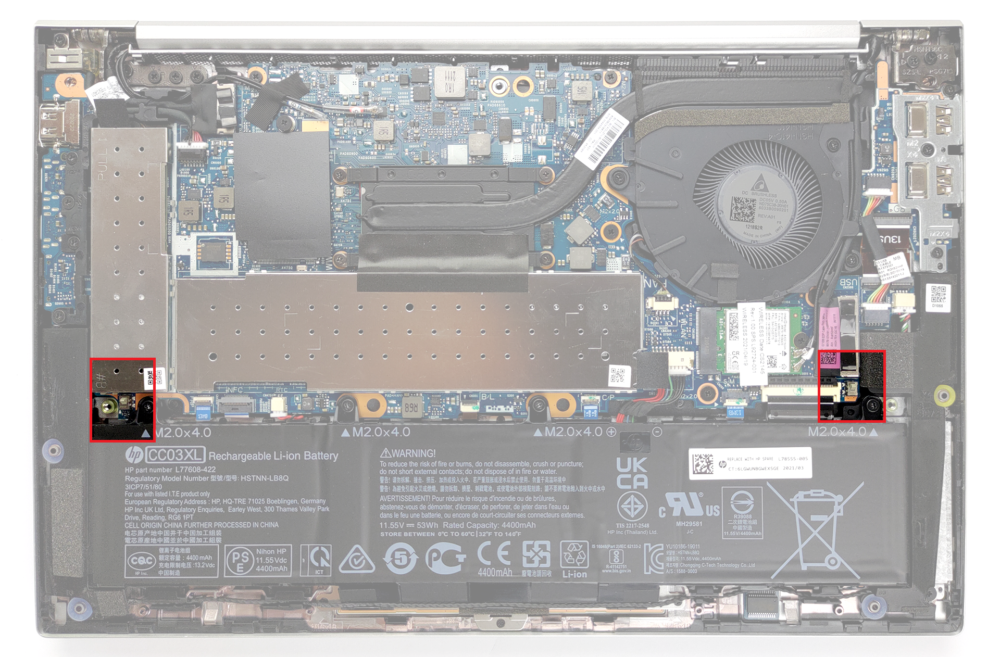

# Identifier les mécanismes anti-effraction

|ID          |
|------------|
|CHSTG-INFO-09|

## Résumé

Ce contrôle vise à identifier visuellement les protections anti-effraction potentielles en utilisant des images haute résolution de carte mère disponibles publiquement et la documentation collectée précédemment. L'objectif est de déterminer si l'appareil inclut une détection d'intrusion physique ou des mécanismes de protection sans accès physique au système.

## Objectifs du test
- Identifier la présence de mécanismes de détection d'effraction
- Identifier les composants de protection liés à la détection d'intrusion
- Mettre en corrélation les mécanismes de protection avec les informations matérielles collectées précédemment

## Comment tester
1. Utiliser la référence carte mère identifiée lors du test CHSTG-INFO-01.

2. Collecter des images haute résolution de la carte mère depuis :
   - Les sites web de revendeurs de pièces détachées
   - Les marchés de réparation
   - Les forums techniques

3. Analyser les images pour identifier les mécanismes anti-effraction possibles tels que :
   - Interrupteurs de détection d'intrusion
   - Circuits de détection d'effraction
   - Capteurs d'ouverture du châssis

Exemples :

- **Dell Latitude 5420 :**  
Image haute résolution disponible à cette adresse :  
https://laptopmedia.com/highlights/inside-dell-latitude-14-5420-disassembly-and-upgrade-options/  
  
Le mécanisme anti-intrusion est facilement identifiable sous la forme de pads de contact situés près du bord de la carte mère.

- **HP EliteBook x360 830 G8 :**  
Image haute résolution disponible à cette adresse :  
https://laptopmedia.com/highlights/inside-hp-elitebook-830-g8-disassembly-and-upgrade-options/  
  
Ici, le mécanisme anti-effraction se présente sous la forme de deux interrupteurs placés de chaque côté du châssis, clairement visibles sur l’image.

4. Mettre en corrélation les observations avec les informations collectées précédemment (identification des composants et documentation) pour confirmer la présence de mécanismes de protection.

5. Documenter les protections identifiées pour les étapes d'analyse ultérieures.

## Remédiation
Non applicable.
