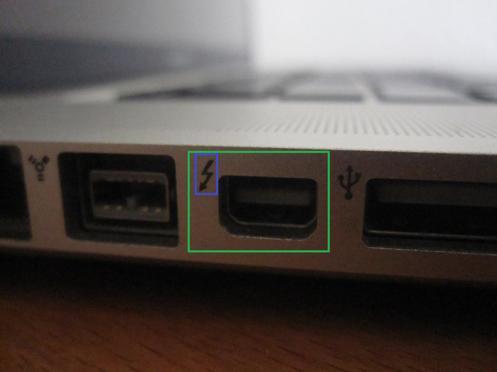

# Assess Thunderbolt 2 Presence

|ID          |
|------------|
|CHSTG-INFO-10|

## Summary

This control aims to determine whether the device includes a Thunderbolt 2 port using external visual inspection and publicly available commercial and technical documentation. The objective is to confirm the presence of this interface without physically interacting with the system.

## Test Objectives
- Identify presence of a Thunderbolt 2 port
- Confirm port type using official documentation
- Correlate visual observations with technical specifications

## How to Test
1. Perform an external visual inspection of the device:
   - Look for Thunderbolt symbols near ports
   - Identify Mini DisplayPort form factor typically used by Thunderbolt 2

Example: the Mini DisplayPort is highlighted in green, while the presence of Thunderbolt 2 is indicated in blue.

Image source: https://fr.wikipedia.org/wiki/Thunderbolt_(interface)#/media/Fichier:MacBook_Pro_2011_Thunderbolt_Port.jpg

2. Use the exact device model identified during test CHSTG-INFO-01.

3. Consult manufacturer commercial and technical documentation:
   - Product specification sheets
   - User manuals
   - Port diagrams

4. Confirm whether the port corresponds to:
   - Standard Mini DisplayPort
   - Thunderbolt 2 interface

5. Document the presence or absence of Thunderbolt 2 for later analysis.

## Remediation
Not applicable.
