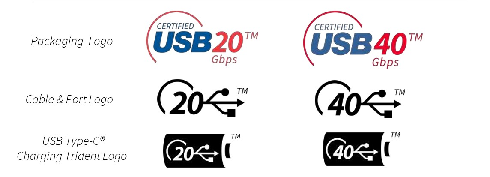

# Évaluer la présence d'USB4

|ID          |
|------------|
|CHSTG-INFO-13|

## Résumé

Ce contrôle vise à déterminer si l'appareil inclut un port USB4 en utilisant l'inspection visuelle externe et la documentation commerciale et technique disponible publiquement. L'objectif est de confirmer la présence de cette interface sans interaction physique avec le système.

## Objectifs du test
- Identifier la présence d'un port USB4
- Confirmer le type de port à l'aide de la documentation officielle
- Mettre en corrélation les observations visuelles avec les spécifications techniques

## Comment tester
1. Effectuer une inspection visuelle externe de l'appareil :
   - Rechercher les logos USB indiquant la capacité USB4
   - Identifier les ports USB-C pouvant prendre en charge USB4

La présence d'un logo USB4 spécifique à proximité d'un port USB-C peut indiquer la prise en charge de cette interface. Voici un exemple de logo :

(Extrait du document officiel : https://www.usb.org/sites/default/files/D1T2-1%20-%20USB%20Branding%20Session.pdf)

Toutefois, il est recommandé de toujours vérifier la documentation technique du fabricant afin de confirmer la compatibilité USB4, car certains ports USB-C peuvent ne pas prendre en charge l'ensemble des fonctionnalités USB4 malgré un logo ressemblant.

2. Utiliser le modèle d'appareil exact identifié lors du test CHSTG-INFO-01.

3. Consulter la documentation commerciale et technique du fabricant :
   - Fiches de spécifications produit
   - Manuels utilisateur
   - Schémas des ports

4. Confirmer si le port USB-C correspond à :
   - USB-C standard
   - Interface USB4

5. Documenter la présence ou l'absence d'USB4 pour l'analyse ultérieure.

## Remédiation
Non applicable.
