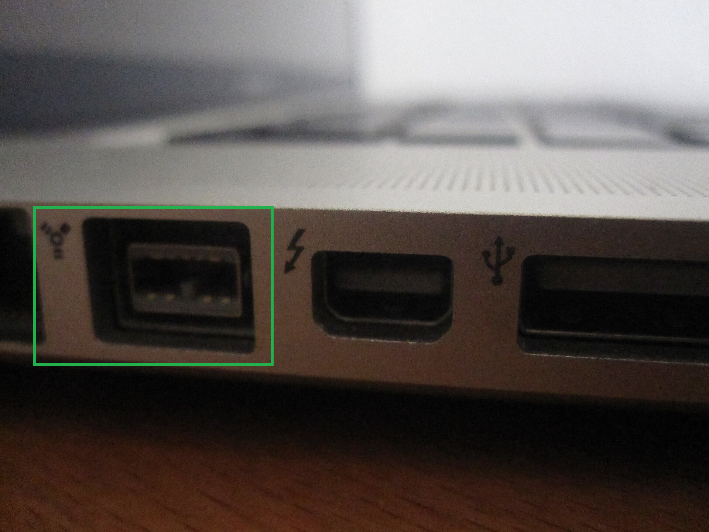

# Évaluer la présence de FireWire

|ID          |
|------------|
|CHSTG-INFO-14|

## Résumé

Ce contrôle vise à déterminer si l'appareil inclut un port FireWire en utilisant l'inspection visuelle externe et la documentation commerciale et technique disponible publiquement. L'objectif est de confirmer la présence de cette interface sans interaction physique avec le système.

## Objectifs du test
- Identifier la présence d'un port FireWire
- Confirmer le type de port à l'aide de la documentation officielle
- Mettre en corrélation les observations visuelles avec les spécifications techniques

## Comment tester
1. Effectuer une inspection visuelle externe de l'appareil :
   - Rechercher les symboles FireWire à proximité des ports
   - Identifier les connecteurs FireWire typiques (4 broches, 6 broches ou 9 broches)

Exemple : port FireWire 800 (IEEE 1394b) sur un MacBook Pro 2011.

(Source de l’image : https://fr.wikipedia.org/wiki/Thunderbolt_(interface)#/media/Fichier:MacBook_Pro_2011_Thunderbolt_Port.jpg)

2. Utiliser le modèle d'appareil exact identifié lors du test CHSTG-INFO-01.

3. Consulter la documentation commerciale et technique du fabricant :
   - Fiches de spécifications produit
   - Manuels utilisateur
   - Schémas des ports

4. Confirmer si le connecteur correspond à une interface FireWire.

5. Documenter la présence ou l'absence de FireWire pour l'analyse ultérieure.

## Remédiation
Non applicable.
