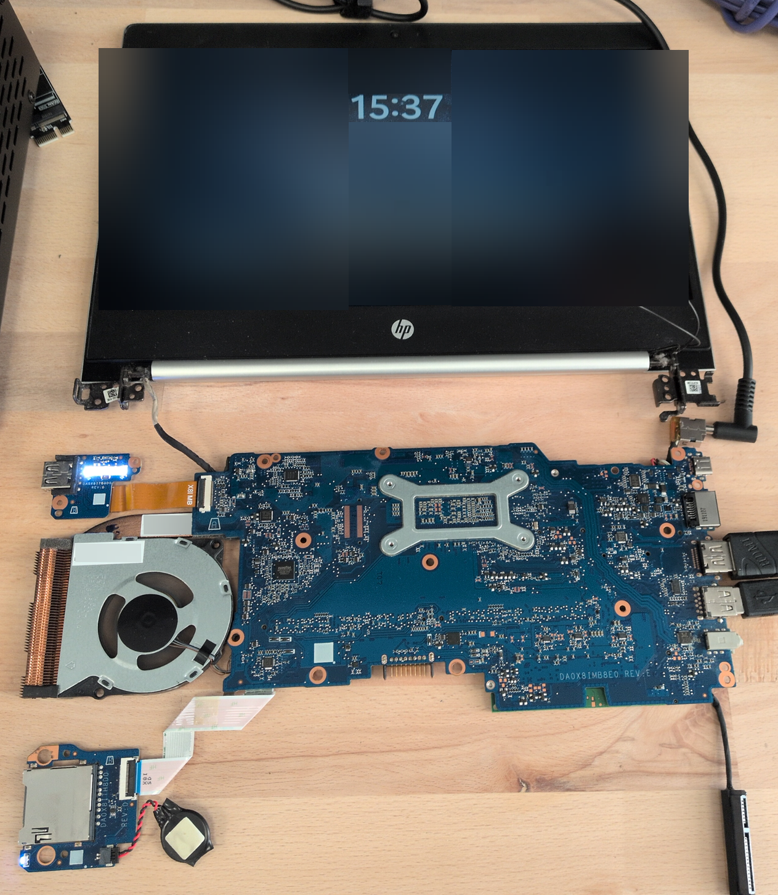
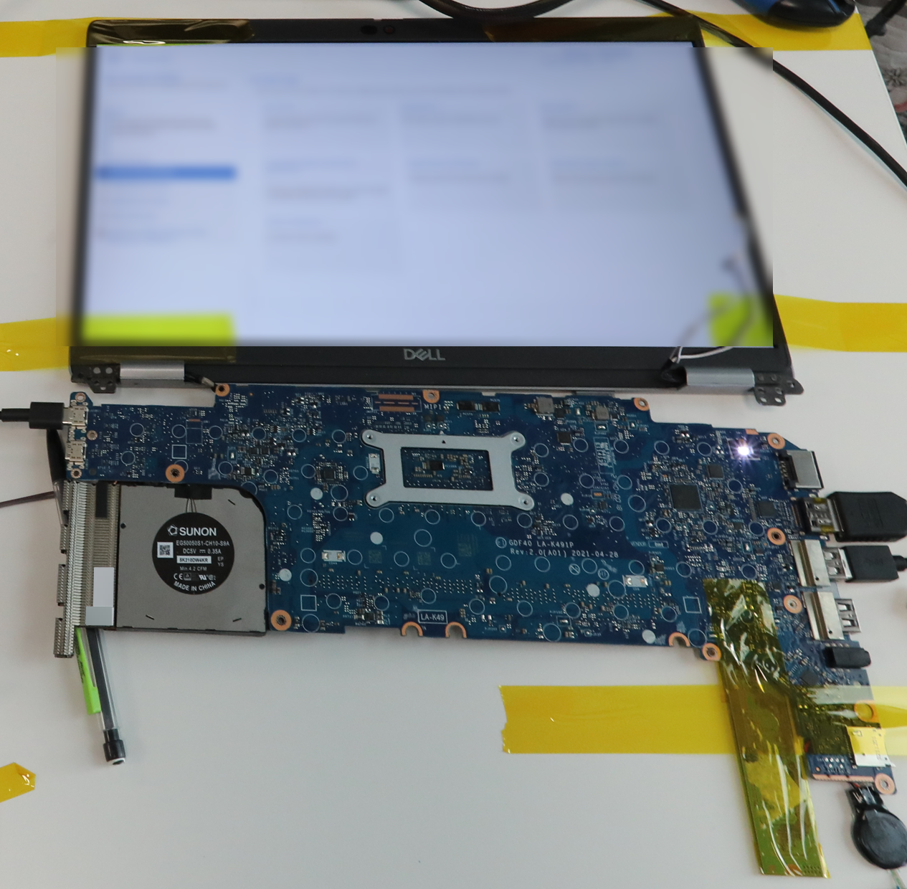

# Évaluer le fonctionnement du système entièrement démonté

|ID          |
|------------|
|CHSTG-PHY-05|

## Résumé

Ce contrôle vise à déterminer si le système reste pleinement opérationnel lorsqu'il est complètement démonté. L'objectif est d'évaluer si l'appareil peut fonctionner normalement en dehors de son châssis, ce qui peut indiquer une application limitée des protections physiques.

## Objectifs du test
- Vérifier si le système démarre lorsqu'il est entièrement démonté
- Confirmer si les protections matérielles empêchent le fonctionnement hors du châssis
- Évaluer la dépendance aux mécanismes de sécurité basés sur le châssis

## Comment tester
1. Démonter entièrement l'appareil selon les procédures standard.

2. Reconnecter uniquement les composants nécessaires au fonctionnement du système (ex. carte mère, alimentation, connexion écran le cas échéant).

3. Mettre le système sous tension.

4. Observer le comportement du système :
   - Le système démarre-t-il normalement ?
   - Le système détecte-t-il l'intrusion du châssis ?
   - La fonctionnalité du système est-elle restreinte ?

Exemple :

- **HP ProBook 430 G6**  
  
Le HP ProBook 430 G6 présenté ici est totalement démonté mais reste pleinement fonctionnel.

- **Dell Latitude 5420**  
  
Le Dell Latitude 5420 également entièrement démonté continue de fonctionner normalement.

Ces deux exemples illustrent que certains systèmes peuvent rester opérationnels même après un démontage complet de leur châssis, en soulignant la possible absence de protections matérielles contraignant le fonctionnement hors du boîtier.

5. Documenter si l'appareil fonctionne entièrement lorsqu'il est démonté.

## Remédiation
Activer toutes les protections anti-effraction disponibles dans les paramètres BIOS/UEFI. Noter que ces protections peuvent toutefois être contournées selon l'implémentation.
