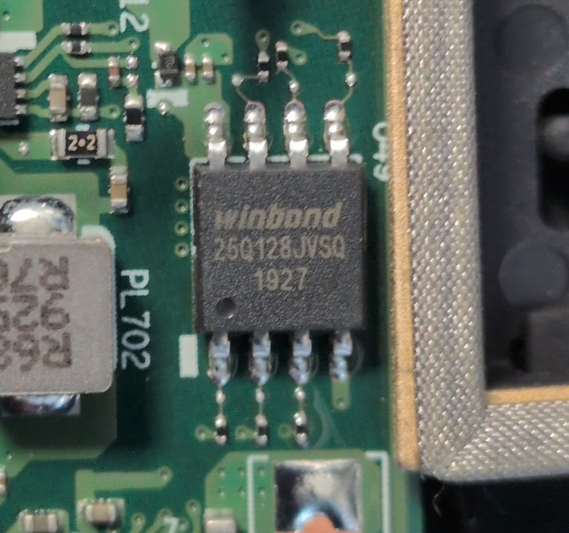
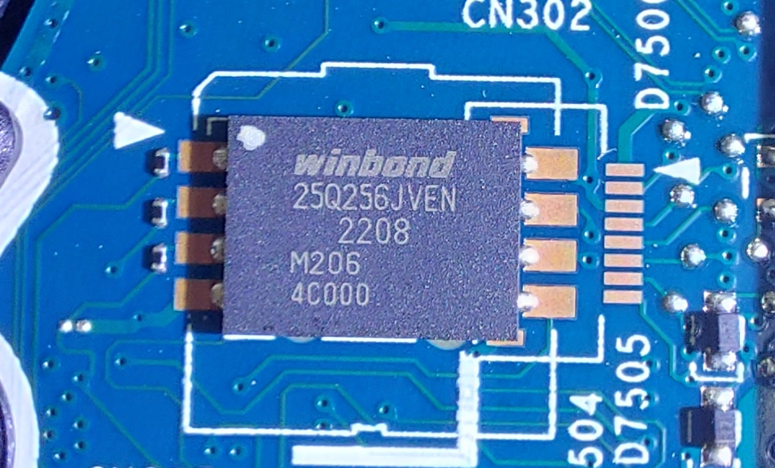
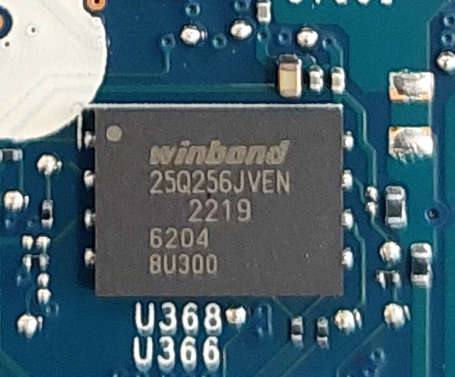

# Identify Firmware / EC Chip Package

|ID          |
|------------|
|CHSTG-INT-11|

## Summary

This control aims to identify the exact physical package type of the BIOS/UEFI firmware chip and the Embedded Controller (EC) chip, if present. The objective is to determine the chip packaging format for hardware analysis purposes.

## Test Objectives
- Identify BIOS/UEFI chip package type
- Identify Embedded Controller (EC) chip package type
- Document physical form factor characteristics

## How to Test
1. Open the device according to standard disassembly procedures.

2. Locate the BIOS/UEFI firmware chip on the motherboard.

3. Visually inspect the chip and determine its package type, such as:
   - SOIC-8
   - TSOP-8
   - WSON
   - QFN
   - Other package formats

Examples of package types:

- **SOIC-8**  
  
Example: BIOS chip Winbond 25Q128 in SOIC-8 package. This type is easily recognizable by its rectangular shape and side pins (8 pins, 4 on each side).

- **QFN8 / WSON8**  
  
Example: BIOS chip Winbond 25Q256 in QFN8/WSON8 package.
  
Example: EC chip Winbond 25Q256 in QFN8/WSON8 package.

4. Locate the Embedded Controller (EC) chip, if present.

5. Visually inspect the EC chip and determine its package type.

6. Document the identified package types for both firmware and EC chips.

## Remediation
Not applicable.