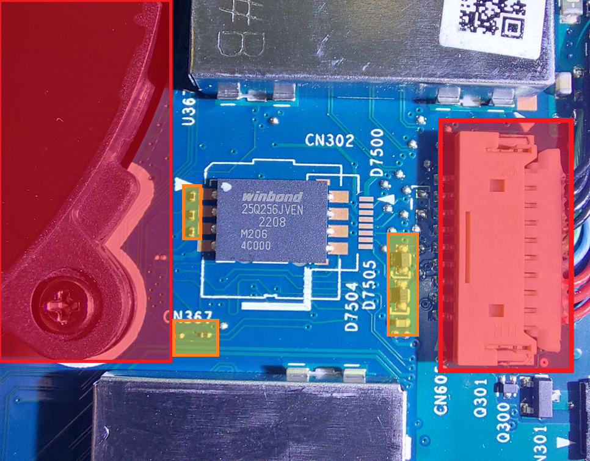
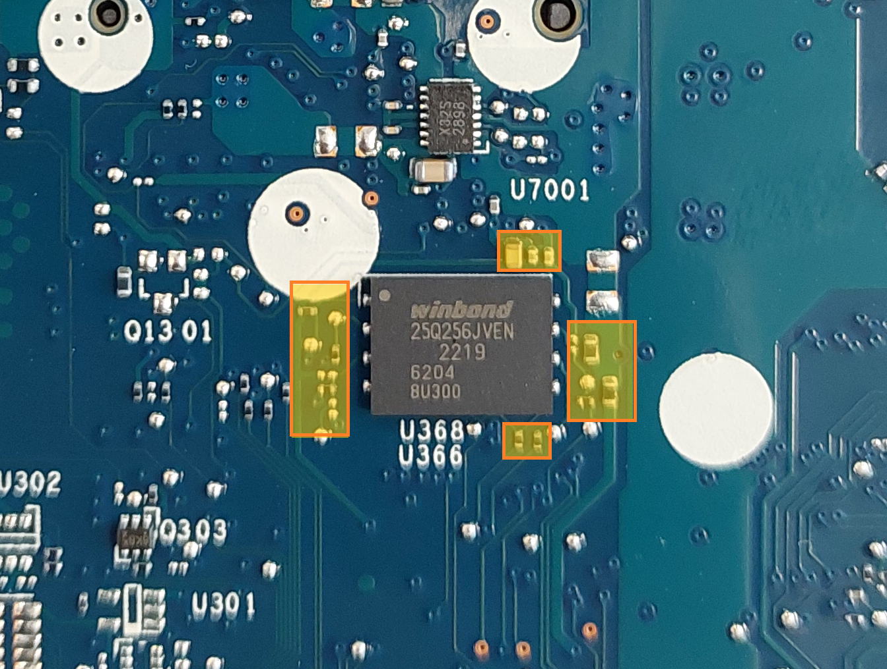
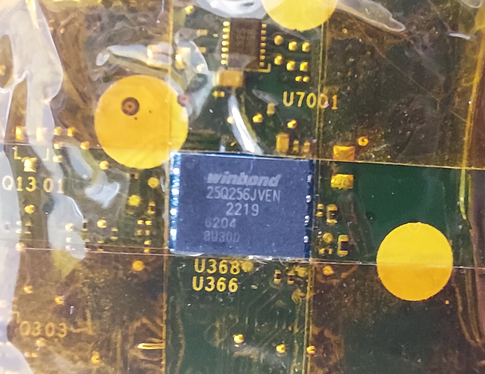
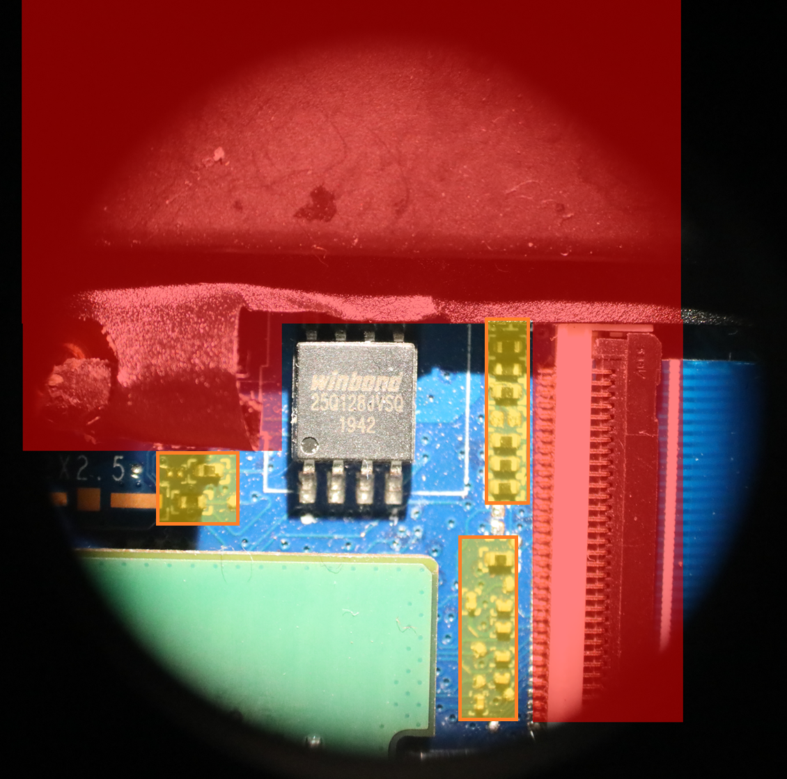

# Évaluer la faisabilité du dessoudage des puces Firmware / EC

|ID          |
|------------|
|CHSTG-INT-12|

## Résumé

Ce contrôle vise à évaluer la faisabilité et la simplicité du dessoudage de la puce de micrologiciel BIOS/UEFI et de la puce du contrôleur embarqué (EC), si présente. L'objectif est d'évaluer le niveau de résistance physique à l'extraction des composants.

## Objectifs du test
- Déterminer si les puces firmware et EC sont techniquement amovibles
- Évaluer la facilité du dessoudage physique
- Évaluer l'exposition des composants sensibles à la manipulation matérielle

## Comment tester
1. Ouvrir l'appareil selon les procédures de démontage standard.

2. Localiser la puce de micrologiciel BIOS/UEFI et la puce du contrôleur embarqué (EC).

3. Évaluer les caractéristiques physiques de chaque puce :
   - Type de boîtier (ex. SOIC-8, TSOP-8, QFN)
   - Accessibilité des broches
   - Présence de résine époxy, blindage ou revêtement de protection
   - Proximité d'autres composants sensibles

Exemples :

- **Puce 1 WSON**  
  
La puce est accessible, mais des connecteurs en plastique (indiqués en rouge) sont relativement proches. Ces éléments sont sensibles à la chaleur et risquent de fondre pendant le dessoudage. En orange, on distingue de très petits composants (résistances, condensateurs) qui, bien qu’insensibles à la chaleur, peuvent être déplacés ou soufflés lors de l’opération. Dans cet exemple, tous les éléments sont cependant suffisamment éloignés pour qu’une protection avec du ruban KAPTON soit efficace.

- **Puce 2 WSON**  
  
Il n’y a pas de composants sensibles à la chaleur à proximité directe de la puce, mais de petits composants sont très proches de la zone à dessouder, ce qui nécessite une protection accrue lors de l’intervention.  

- **Puce 3 SOIC-8**  
  
Bien que la puce soit au format SOIC-8, ce qui facilite généralement le dessoudage, la présence immédiate d’éléments sensibles à la chaleur empêche un retrait direct de la puce. Cette opération reste possible à condition de retirer tous les éléments à proximité et d'appliquer une protection renforcée sur les composants sensibles.

4. Évaluer si les puces :
   - Sont directement accessibles
   - Nécessitent le retrait d'un blindage
   - Semblent faciles ou complexes à dessouder selon le type de boîtier et la disposition de la carte

5. Documenter le niveau de faisabilité global (Faible / Moyen / Élevé).

## Remédiation
Appliquer une résine époxy sur les composants sensibles (ex. puces BIOS/UEFI et EC) pour empêcher l'extraction ou la manipulation physique.
