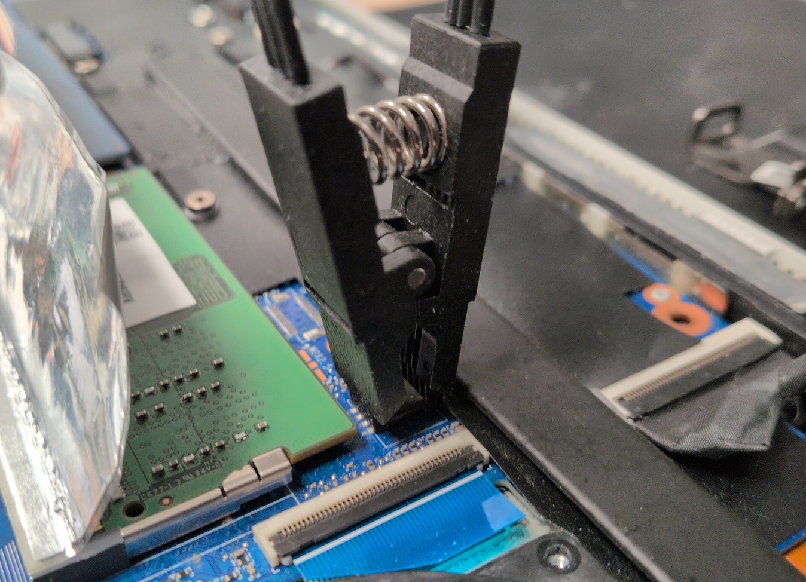

# Évaluer l'accès lecture/écriture aux puces Firmware / EC sans dessoudage

|ID          |
|------------|
|CHSTG-INT-13|

## Résumé

Ce contrôle vise à évaluer si la puce de micrologiciel BIOS/UEFI et la puce du contrôleur embarqué (EC), si présente, peuvent être lues ou écrites sans dessoudage. L'objectif est d'évaluer l'exposition à un accès en circuit via sondage physique ou techniques par pince.

## Objectifs du test
- Déterminer si les puces firmware et EC sont accessibles en circuit
- Évaluer la faisabilité des opérations lecture/écriture sans retrait de la puce
- Évaluer l'exposition des composants connectés en SPI à un accès direct au bus

## Comment tester
1. Ouvrir l'appareil selon les procédures de démontage standard.

2. Localiser la puce de micrologiciel BIOS/UEFI et la puce EC.

3. Évaluer l'accessibilité physique :
   - Exposition et espacement des broches
   - Type de boîtier (ex. SOIC-8)
   - Présence de revêtement conformant, résine époxy ou blindage
   - Accessibilité des traces SPI ou pastilles de test

4. Évaluer si la disposition de la carte semble permettre :
   - La fixation d'une pince en circuit
   - Le sondage direct du bus SPI

Exemple :

- Pince SOIC-8  
  
Dans cet exemple, la puce BIOS utilise un boîtier SOIC-8, ce qui autorise l’utilisation d’une pince dédiée pour réaliser des opérations de lecture et d’écriture sans retirer la puce de la carte mère. Ce scénario correspond à l’exemple 3 du test CHSTG-INT-12, où le dessoudage était difficile à cause de la proximité d’éléments sensibles. Ici, la méthode par pince permet d’éviter ces contraintes tout en accédant facilement au bus SPI.

5. Documenter le niveau de faisabilité global (Faible / Moyen / Élevé) selon l'accessibilité et les mesures de protection.

## Remédiation
Appliquer une résine époxy sur les composants sensibles (ex. puces BIOS/UEFI et EC) pour empêcher l'accès physique en lecture/écriture.
