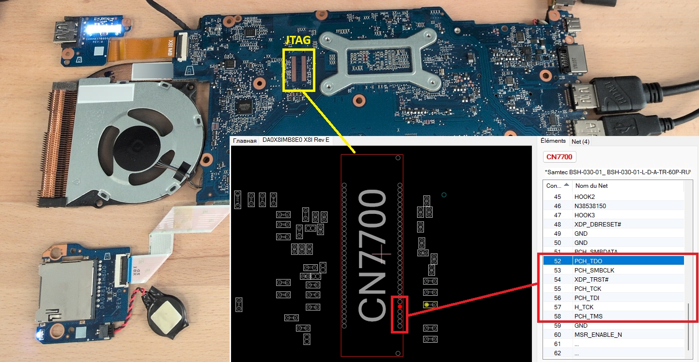

# Assess Presence of JTAG Debug Port

|ID          |
|------------|
|CHSTG-DEBUG-03|

## Summary

This control aims to determine whether a dedicated JTAG debug port is present on the motherboard. Identification may be performed through schematic and boardview analysis or by direct visual inspection of the motherboard. The objective is to assess the exposure of JTAG-based debugging interfaces.

## Test Objectives
- Identify presence of a JTAG debug interface
- Locate potential JTAG headers, pads, or connectors
- Assess exposure level of hardware debug access

## How to Test
1. Review available documentation:
   - Schematic files
   - Boardview files

   Identify signals typically associated with JTAG communication (e.g., TCK, TMS, TDI, TDO, TRST).

2. Perform direct visual inspection of the motherboard:
   - Look for unpopulated headers or test pads
   - Identify labels such as JTAG, DEBUG, JTCK, JTMS, or similar
   - Locate connectors near the main processor, chipset, or embedded controller

Example:
- **HP Probook 430 G6**

On the HP Probook 430 G6, the JTAG debug port is clearly identifiable through the analysis of the Boardview file, which allows for precise location of the related signals and connectors.

3. If signal observation is within authorized scope, assess whether JTAG activity could theoretically be observed using:
   - Pogo probe systems (e.g., PCBite)
   - A logic analyzer (e.g., Saleae, DSLogic)

4. Document:
   - Presence or absence of a JTAG debug interface
   - Physical location
   - Accessibility level
   - Documentation references (if identified via schematic/boardview)

## Remediation
Not applicable.