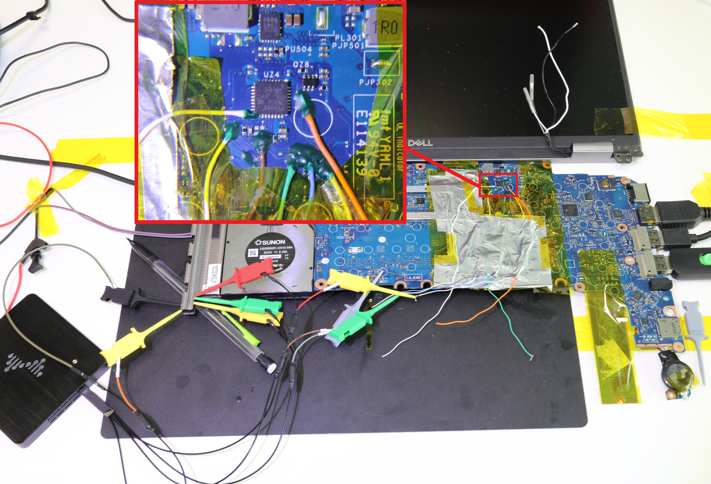
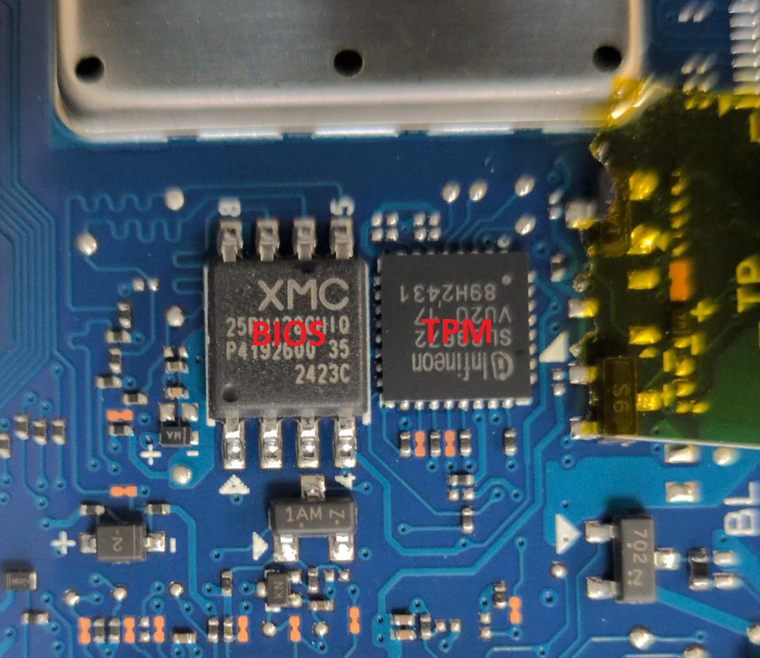

# Assess Feasibility of Capturing TPM Bus Traffic During Boot

|ID          |
|------------|
|CHSTG-TPM-01|

## Summary

The Trusted Platform Module (TPM) is responsible for securely storing and releasing encryption keys, such as the BitLocker Volume Master Key (VMK). In many configurations, specifically "TPM-only" modes, the module automatically releases the key to the CPU over a physical bus (SPI or I2C) during the boot process. This control evaluates the risk of intercepting this sensitive data by physically sniffing the communication bus using logic analyzers. This attack is particularly effective because the communication between the TPM and the CPU is often unencrypted.

## Test Objectives
- Identify the physical bus type (SPI, I2C, or LPC) used by the TPM.
- Successfully capture the digital signals during the system's power-on self-test (POST) and OS boot phase.
- Determine if the captured traffic contains exploitable material, such as cleartext encryption keys.

## How to Test
This test requires internal physical access to the motherboard to place probes on the communication lines. 

### Hardware Setup
1.  **Logic Analyzer:** Use a logic analyzer with a sample rate of at least 100MHz to ensure high-speed SPI signals are captured accurately.
2.  **Probing Tools:** Use pogo-pin probes (e.g., **PCBite**) for non-destructive, hands-free contact with small chip pins or test pads.
3.  **Signal Identification:**
    * **SPI Bus:** Locate and probe the **MISO** (Master In Slave Out), **MOSI** (Master Out Slave In), and **CLK** (Clock) lines. 
    * **Chip Select (CS):** While not strictly required for decoding, probing the CS line helps differentiate between components on a shared bus.
4.  **Shared Bus Strategy:** Since the SPI bus is often shared between the TPM, BIOS/UEFI, and Embedded Controller (EC), you can capture TPM traffic by probing the BIOS or EC chip pins if the TPM is physically inaccessible (e.g., located on the underside of the board). Use the BIOS CS signal to identify non-BIOS traffic (the TPM is active when the BIOS CS is high/inactive).

Examples:

- **HP Probook 430 G6**  
    
  Here, probes are placed directly around the TPM chip. There is ample space around the chip to position the probes securely, which allows a clean and therefore usable signal to be obtained.

- **Dell Latitude 5420**  
    
  In some cases, the probes do not stay in place well or the captured signal is not clean enough for effective analysis. An alternative is to solder very fine wires directly onto the SPI bus lines to ensure a reliable connection and obtain the best possible signal for decoding.

- **Samsung NP754XGK**  
    
  On this model, the BIOS chip and the TPM chip are very close to each other, making it particularly difficult to position probes around the TPM. However, since both circuits share the same SPI bus, it is possible to intercept TPM traffic via the BIOS chip pins, thus making it easier to capture the signal without direct access to the TPM.  
  

### Software Execution
1.  **Configure Analyzer:** Set the logic analyzer software to trigger on the first transitions of the CLK or CS lines.
2.  **Power On:** Start the target system.
3.  **Capture and Decode:** Use SPI/I2C decoders within the analyzer software to convert the raw waveforms into hex data.

## Remediation
- **Pre-Boot Authentication:** Configure disk encryption (e.g., BitLocker) to require a **PIN code** or a startup key in addition to the TPM. This prevents the TPM from releasing the master key into the bus until the user has been successfully authenticated.
- **TPM Parameter Encryption:** If supported by the hardware and OS, enable TPM 2.0 parameter encryption to protect the sensitivity of the data traversing the bus.
- **Physical Protection:** Ensure the chassis is secured with tamper-evident mechanisms to detect unauthorized internal access.