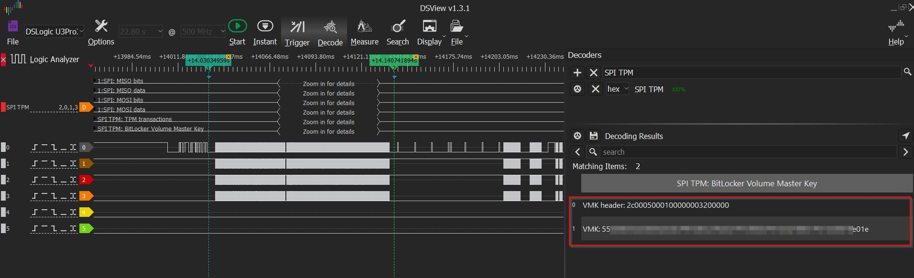

# Évaluer l'extraction des clés maîtresses via l'analyse du trafic TPM

|ID          |
|------------|
|CHSTG-TPM-02|

## Résumé

Une fois les signaux physiques bruts du bus TPM (SPI ou I2C) capturés, l'étape suivante consiste à effectuer une analyse logique pour extraire les données sensibles. En décodant le protocole de communication, un attaquant peut identifier les commandes et réponses TPM spécifiques—telles que celles liées aux citations PCR (Platform Configuration Register) ou au déscellement d'objets—pour intercepter les clés de chiffrement disque en clair lors de leur transmission au processeur. Ce contrôle évalue la faisabilité de convertir les formes d'onde capturées en matériel cryptographique exploitable.

## Objectifs du test
- Décoder les formes d'onde SPI ou I2C capturées en données hexadécimales lisibles ou structures de commandes TPM.
- Identifier et isoler l'échange spécifique où la clé maîtresse de chiffrement disque est libérée.
- Extraire avec succès la clé maîtresse de volume (VMK) ou l'équivalent pour prouver la vulnérabilité.

## Comment tester
Ce test fait suite à la capture physique décrite dans **CHSTG-TPM-01** et se concentre sur l'analyse logicielle des journaux de trafic.

### Prérequis logiciels
- **Logiciel d'analyse :** Utiliser des outils tels que **Logic2** (pour Saleae) ou **DSView** (pour DreamSourceLab) pour traiter les fichiers de capture.
- **Décodeurs de protocole :** S'assurer que les décodeurs SPI ou I2C sont actifs et correctement configurés (ex. polarité et phase d'horloge appropriées pour SPI).

### Exécution de l'analyse
1.  **Charger la capture :** Importer le fichier de capture haute résolution dans **Logic2** ou **DSView**.
2.  **Appliquer les décodeurs :**
    * Pour **SPI** : Mapper les canaux sur MISO, MOSI, CLK et CS.
    * Pour **I2C** : Mapper les canaux SDA et SCL.
3.  **Identifier le trafic TPM :** Rechercher les motifs de commandes TPM 2.0 standard. Spécifiquement, rechercher la commande `TPM2_Unseal` ou les réponses suivant une validation PCR réussie.
4.  **Extraire le matériel de clé :**
    * Analyser les paquets de données suivant la requête de déscellement.
    * Rechercher une séquence de 32 octets (256 bits) ou 64 octets qui ne change pas entre les démarrages, qui représente souvent la clé de chiffrement maîtresse.
5.  **Validation :** Utiliser la clé hex extraite avec des outils de déchiffrement hors ligne (ex. `dislocker` pour BitLocker ou `cryptsetup` pour LUKS) pour vérifier si elle monte avec succès la partition chiffrée.

Exemple :

Exemple d’interception et de décodage de la clé VMK BitLocker à l’aide d’un analyseur logique DSLogic U3Pro32 et du logiciel DSView.  

## Remédiation
- **PIN/Phrase de passe obligatoire :** Configurer le système pour exiger un **PIN BitLocker** ou une phrase de passe LUKS au pré-démarrage. Cela garantit que le TPM ne libère pas la clé maîtresse sur le bus tant que l'utilisateur n'a pas fourni un second facteur d'authentification.
- **Chiffrement du bus TPM 2.0 :** Activer les fonctionnalités « Parameter Encryption » si pris en charge par la carte mère et le système d'exploitation (ex. Windows 11 avec matériel compatible), qui chiffre les données sensibles lors de leur transit entre le TPM et le processeur.
- **Mises à jour du firmware :** S'assurer que le firmware BIOS/UEFI et TPM est à jour pour prendre en charge les derniers protocoles de sécurité et mécanismes de protection du bus.
