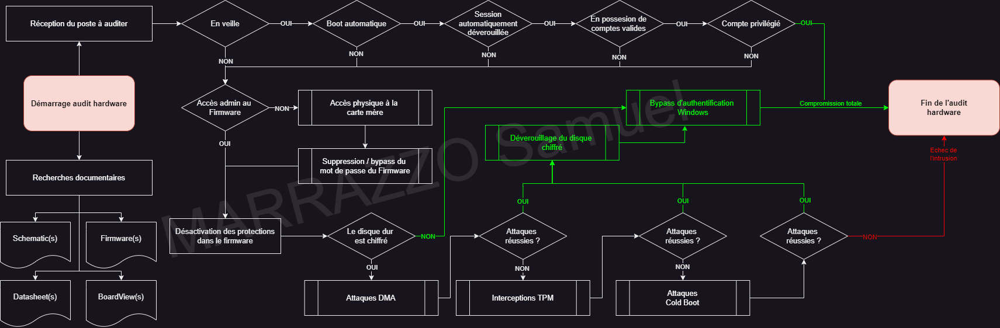
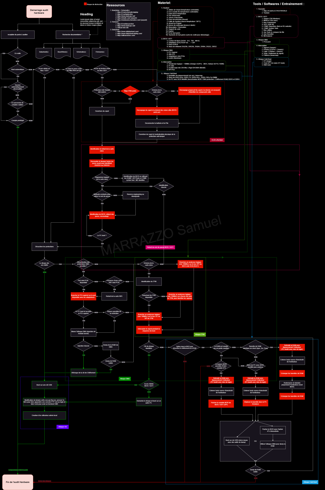

# Guide de test de sécurité matérielle des ordinateurs (CHSTG)

**Code :** chstg  
**Version :** 1.0

Basé sur le squelette méthodologique OWASP comme le [WSTG](https://github.com/OWASP/wstg/tree/master)

## Sections
- [01 — Collecte d'informations (sans accès physique interne)](01-Information_Gathering_Without_Internal_Physical_Access/README_fr.md)
- [02 — Sécurité du démarrage](02-Boot_Security/README_fr.md)
- [03 — Sécurité du micrologiciel](03-Firmware_Security/README_fr.md)
- [04 — Tests d'accès physique](04-Physical_Access_Testing/README_fr.md)
- [05 — Collecte d'informations internes (avec accès physique interne)](05-Internal_Information_Gathering_With_Internal_Physical_Access/README_fr.md)
- [06 — Interfaces de débogage](06-Debug_Interfaces/README_fr.md)
- [07 — Attaques DMA](07-DMA_Attacks/README_fr.md)
- [08 — TPM et chaîne de confiance](08-TPM_and_Chain_of_Trust/README_fr.md)
- [09 — Attaques mémoire](09-Memory_Attacks/README_fr.md)
- [10 — Chiffrement disque et stockage](10-Disk_Encryption_and_Storage/README_fr.md)
- [11 — Post-exploitation et persistance](11-Post-Exploitation_and_Persistence/README_fr.md)

## Processus de vérification
### Processus de pentest matériel (version courte)

### Processus de pentest matériel (version complète)

## Déclaration d'utilisation de l'IA

Cette méthodologie a été structurée et mise en forme avec l'aide d'outils d'intelligence artificielle (IA).

L'IA a été utilisée **exclusivement pour la mise en forme, l'harmonisation de la structure et l'amélioration de la langue**, afin de maintenir un cadre méthodologique cohérent dans toutes les sections.

En problème de dyslexie, la rédaction et la maintenance d'une documentation structurée volumineuse sont particulièrement difficiles. L'assistance de l'IA a donc été utilisée comme outil de soutien pour la cohérence éditoriale et la lisibilité.

**Important :**  
Tout le contenu technique, les étapes de test, les chemins d'attaque, la conception de la méthodologie et les concepts de sécurité ont été conçus et validés manuellement sans l'IA.

L'IA n'a pas conçu, inventé ni défini aucune procédure de test contenue dans ce guide.

## Licence

Shield : [![CC BY-SA 4.0][cc-by-sa-shield]][cc-by-sa]

Ce travail est distribué sous la
[Licence internationale Creative Commons Attribution - Partage dans les Mêmes Conditions 4.0][cc-by-sa].

[![CC BY-SA 4.0][cc-by-sa-image]][cc-by-sa]

[cc-by-sa]: http://creativecommons.org/licenses/by-sa/4.0/
[cc-by-sa-image]: https://licensebuttons.net/l/by-sa/4.0/88x31.png
[cc-by-sa-shield]: https://img.shields.io/badge/License-CC%20BY--SA%204.0-lightgrey.svg
